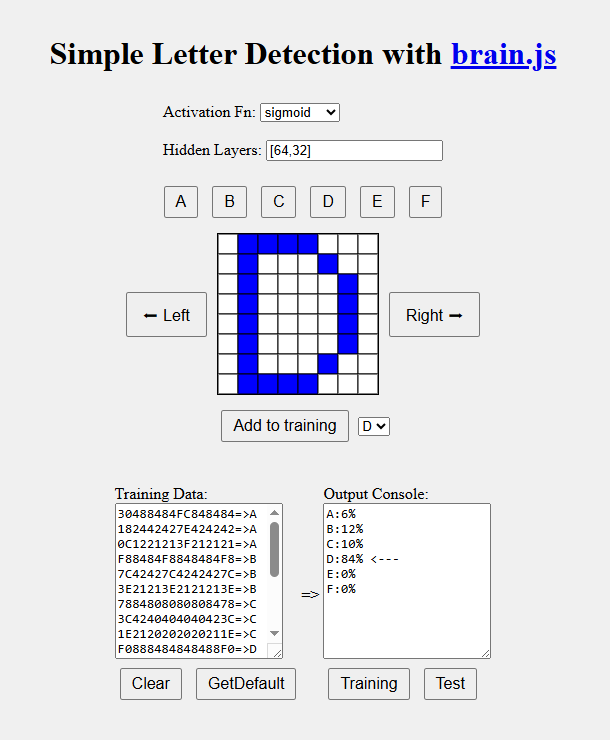

# 🧠 Simple Letter Detection with Brain.js 

This project demonstrates how to use [Brain.js](https://brain.js.org) and JavaScript to build a simple neural network that recognizes letters (A to F) based on their pixel representations.

## 🔍 Overview

The user can:
- Display a letter on an 8x8 grid
- Modify the pattern by clicking on the canvas
- Add samples to the training dataset
- Train the neural network
- Test recognition of the current input

## 🧩 Technologies Used

- **[Brain.js](https://brain.js.org/)** — Neural networks in JavaScript
- **HTML5 Canvas** — Drawing interface for letter shapes
- **Vanilla JS** — Data handling and UI logic

## 📂 Project Structure

- `index.html` — Main app UI. It contains everything. Thats all you need to test the project

## 🚀 How to Run (see [demo on youtube](https://youtu.be/73i75CEyvzM))

1. Open [index.html](https://raw.githack.com/alex-lysenko-de/brain-js-demo/main/index.html) in a web browser.
2. Click on a letter button (A–F) to show its default shape on the grid.
3. Modify the shape by clicking cells in the grid.
4. Press **"Add to training"** to add it to the training set.
5. Choose the activation function and hidden layer structure.
6. Click **"Training"** to train the network.
7. Click **"Test"** to recognize the current pattern.

## 🛠 Example Training Data Format

Training samples are stored in a text area as:

```
30488484FC848484=>A
F88484F8848484F8=>B
...
```

Where the part before `=>` is the encoded 8x8 image in hexadecimal, and the letter after `=>` is the expected output.


## ✅ Features

- Select activation function: sigmoid, relu, tanh, etc.
- Configure hidden layers dynamically
- Store training data in `localStorage`
- Interactive canvas with left/right shift buttons


## 🧠 Brain.js Configuration

```js
{
  learningRate: 0.01,
  iterations: 20000,
  errorThresh: 0.005,
}
```

## 📄 License

MIT — Free to use with attribution 😊

---

> Built as a fun side project exploring neural networks and JavaScript.
>

## 📷 Screenshot

[](https://youtu.be/73i75CEyvzM)
